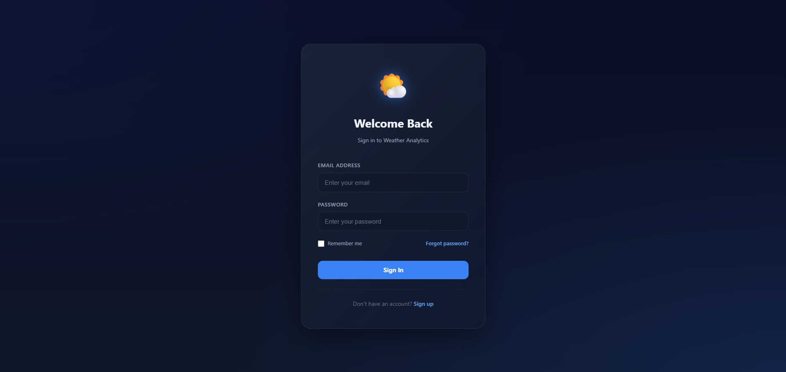
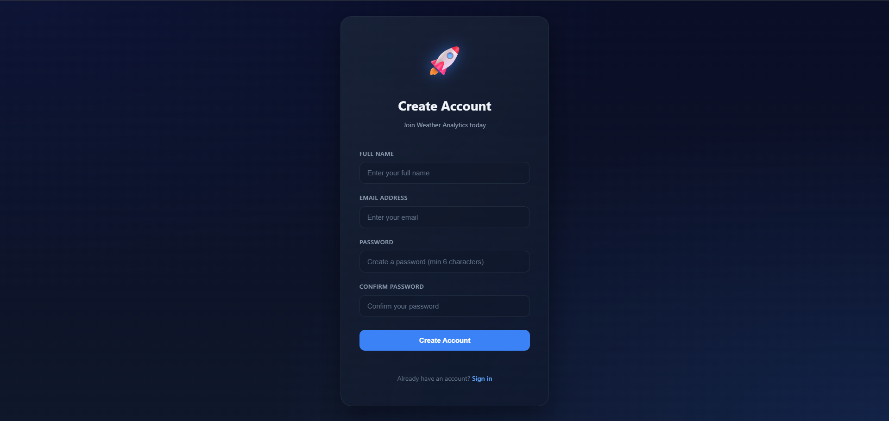
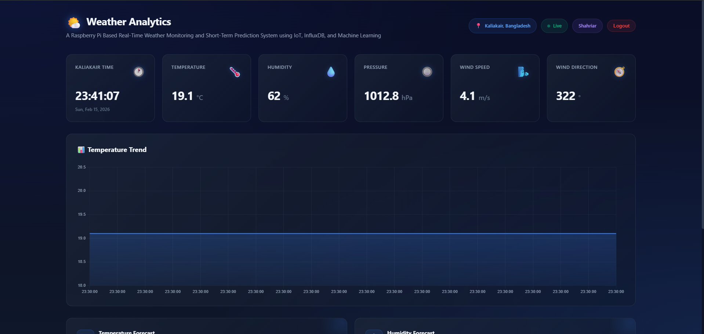
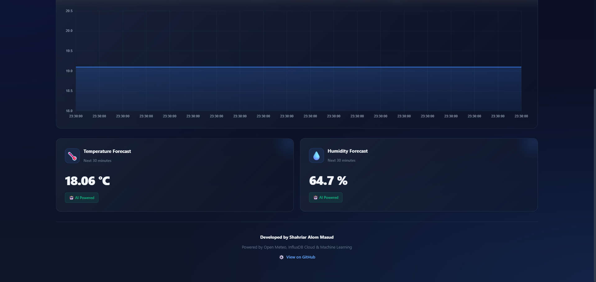
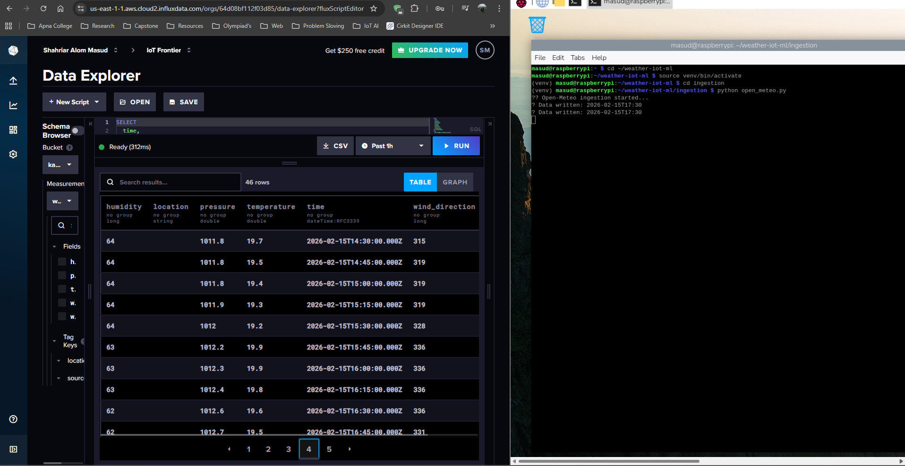

# A Raspberry Pi Based Real-Time Weather Monitoring and Short-Term Prediction System using IoT, InfluxDB, Open-Meteo and Machine Learning


A complete **end-to-end IoT + Cloud + Machine Learning project** that collects real-time weather data, stores it in a time-series database, performs short-term predictions, and visualizes everything on a live web dashboard.

---

## Project Overview

This project demonstrates how modern IoT systems integrate **edge devices**, **cloud databases**, **REST APIs**, **machine learning models**, and **web dashboards** into a single, scalable architecture.

The system:

- Collects **real-time weather data** from Open-Meteo API
- Runs a **continuous ingestion service** on Raspberry Pi
- Stores data in **InfluxDB Cloud** (time-series database)
- Exposes data via **FastAPI backend**
- Predicts temperature & humidity for the **next 30 minutes** using ML
- Visualizes live + predicted data on a **Netlify-hosted dashboard**

---

## Key Features

- Real-time weather monitoring
- Raspberry Pi based data ingestion
- Cloud-native time-series storage (InfluxDB)
- FastAPI powered REST backend
- Machine Learning based short-term prediction
- Interactive live dashboard (Chart.js)
- Deployed using modern DevOps tools

---

## System Architecture

```
Open-Meteo API
      ↓
Raspberry Pi (Ingestion Service)
      ↓
InfluxDB Cloud (Time-Series Storage)
      ↓
FastAPI Backend (REST API + ML)
      ↓
Netlify Frontend (Dashboard)
```

##  Live Project Demo

You can visit the live deployed dashboard here:

 **Live Dashboard:**  
https://raspberrypi-weather-dashboard.netlify.app/

The dashboard displays:
- Real-time weather data
- Interactive charts and trends
- Short-term temperature & humidity predictions
- AI-powered forecast indicators

> Note: Data updates automatically based on the Raspberry Pi ingestion service and backend API.


##  Project Screenshots

###  User Authentication – Login


###  User Authentication – Sign Up


###  Weather Analytics Dashboard (Live View)


###  Real-Time Temperature Trend & Forecast


###  InfluxDB Cloud – Time-Series Data Storage



## Data Ingestion Layer (Raspberry Pi)

- Runs continuously on Raspberry Pi
- Fetches live weather data from **Open-Meteo API**
- Pushes data every **5 minutes** to InfluxDB


---

## Project Structure

```
raspberrypi-weather-iot-ml/
│
├── backend/        # FastAPI + ML backend
│   ├── app/
│   │   ├── main.py
│   │   ├── api/
│   │   │   └── weather.py
│   │   ├── core/
│   │   │   └── config.py
│   │   └── services/
│   │       └── influx_service.py
│   └── ml/
│       ├── data_loader.py
│       ├── preprocess.py
│       ├── predict.py
│       ├── train_baseline.py
│       ├── temp_model.pkl
│       └── hum_model.pkl
│
├── ingestion/      # Raspberry Pi data ingestion
│   └── open_meteo.py
│
├── database/       # InfluxDB helpers
│   └── influx.py
│
├── frontend/       # Web dashboard
│   ├── index.html
│   ├── style.css
│   └── script.js
│
├── config/         # Environment configuration
├── .gitignore
├── README.md
└── LICENSE
```

---

**Key File:**

```
ingestion/open_meteo.py
```

---

## Database Layer (InfluxDB Cloud)

- Time-series optimized storage
- Stores temperature, humidity, pressure, wind speed, wind direction
- Supports high-frequency writes & queries

**Measurement Example:**

- weather_live

---

## ⚙️ Backend Layer (FastAPI)

The backend serves as the **central brain** of the system.

### Available API Endpoints

| Endpoint               | Description                   |
| ---------------------- | ----------------------------- |
| `/`                    | Health check                  |
| `/api/weather/latest`  | Latest live weather data      |
| `/api/weather/predict` | ML-based 30-minute prediction |

---

## Machine Learning Module

### Objective

Predict **temperature** and **humidity** for the next 30 minutes.

### Approach

- Model: Linear Regression
- Input: Last 60 minutes (12 data points)
- Output: Temperature & Humidity (t + 30 min)

### ML Pipeline

```
InfluxDB → Data Loader → Preprocessing → Model → Prediction
```

---

## Frontend Dashboard

- Built using HTML, CSS, JavaScript
- Uses Chart.js for visualization
- Auto-refreshes live data every **5 seconds**
- Updates predictions every **30 seconds**

**Deployment:** Netlify

---

## Deployment Summary

| Component | Platform       |
| --------- | -------------- |
| Ingestion | Raspberry Pi   |
| Database  | InfluxDB Cloud |
| Backend   | Render (API)   |
| Frontend  | Netlify        |

---

## Environment Variables

All sensitive credentials are stored using `.env`:

```
INFLUX_URL=...
INFLUX_TOKEN=...
INFLUX_ORG=...
INFLUX_BUCKET=...
```

---

## Testing & Validation

- Verified live data flow from Raspberry Pi to InfluxDB
- Validated API responses via browser & fetch calls
- Compared dashboard values with InfluxDB Data Explorer

---

## Academic & Practical Relevance

- IoT Architecture Design
- Cloud Databases (Time-Series)
- RESTful API Development
- Machine Learning Integration
- Full-Stack Deployment

---

## Future Improvements

- Replace Linear Regression with LSTM/GRU
- Add anomaly detection
- Deploy backend on Raspberry Pi locally
- Add alerting system (SMS / Email)
- Secure APIs with authentication

---

## Author

Shahriar Alom Masud  
B.Sc. Engg. in IoT & Robotics Engineering  
University of Frontier Technology, Bangladesh  
Email: shahriar0002@std.uftb.ac.bd  
LinkedIn: https://www.linkedin.com/in/shahriar-alom-masud

---

## License

This project is licensed under the **MIT License**.

---

If you like this project, give it a star on GitHub!
